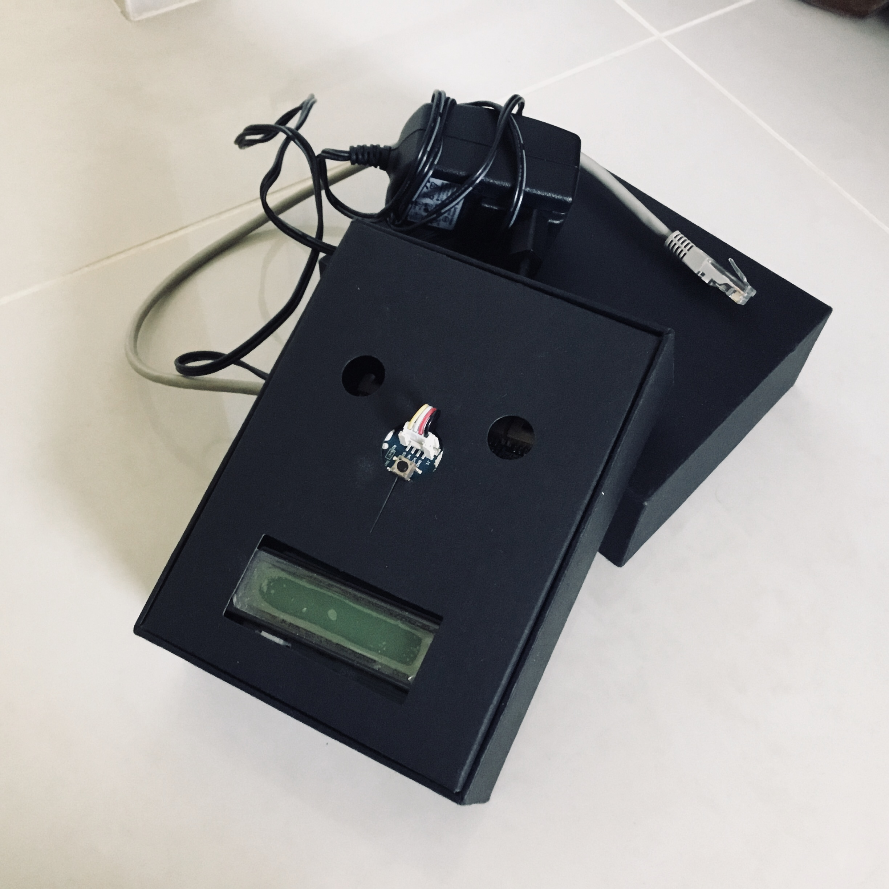

# BALI, la Boite Aux Lettres Intelligente

 

### Synopsis

Votre boite aux lettres vous informera en temps réel, par le biais d'un mail, de la réception de votre courrier et vous l'indiquera visuellement par une couleur verte sur l’écran, qui deviendra rouge après réinitialisation de la boite aux lettres par simple pression d'un bouton. Elle pourra également vous transférer l'historique de vos réceptions et récupérations de courrier sur un mois via un graphique.

N'hésitez pas à vous référer au **manuel d'utilisation** pour plus de détails.

 

### Motivation

Ce projet a été réalisé dans le cadre du module Fondamentaux de l'Architecture et du Système d'un Ordinateur (FASO) du cycle ingénieur en Informatique et Gestion, Polytech' Montpellier. 

 

### Pour commencer ...

Assurez-vous que vous disposez de tout le matériel nécessaire : écran LCD, bouton pression, capteur de mouvement, shield GrovePi, raspberry et ses cables ethernet et d'alimentation.

 

### Hiérarchie du code

Le projet est composé de plusieurs fichiers sous format .py tous à la racine :

Fichier | Contenu
--------- | --------
**Main**.py | programme principal
**driverLCD**.py | pilote l'affichage de l'écran LCD
**driverDigital**.py | pilote le capteur de mouvement et le bouton
**driverMail**.py | envoi de mails (avec et sans pièce jointe)
**bilanMensuel**.py | créer un graphique historique sous format png

 

### Installation

Pour mettre en place bali, suivez les étapes suivantes : 

  1. brancher le cable ethernet RJ45 à un port réseau
  2. brancher l'alimentation de la raspberry à une prise

 

### Mise en marche

Tout d'abord, téléchargez tous les fichiers .py du projet sur votre raspberry. Puis, depuis votre machine locale connectez-vous à votre raspberry (en SSH via le terminal).

Ensuite, pour faire fonctionner BALI, rien de plus simple que d'exécuter le programme principal.

Lancez alors le fichier Main.py avec la commande "python Main.py" et le tour est joué.

Le code du programme étant écrit pour une démonstration rapide, il n'est fonctionnel que pour une minute. Assurez-vous donc de commencer en début de minute pour un graphique historique optimal.

 

### Versions des logiciels et Biliothèques

Raspberry Pi 3
Python : 2.7.9
GrovePi : 1.2.2

Bibliothèques datetime, time, matplolib, numpy, smbus, smtplib, email.mime.text, email.mime.  

 

### Perspectives

Si vous souhaitez améliorer ce projet, nous vous proposons de :

  - mettre en place une batterie à la raspberry au lieu d'une alimentation sous secteur
  - utiliser une borne WiFI au lieu du cable Ethernet RJ45
  - installer une caméra sur bali qui prend une photo des personnes ayant déposé du courrier

 

## Auteurs

 **CHAWAF Alia** & **GARDEISEN Marine**, Polytech' Montpellier, 3ème année Informatique et Gestion

###### *Pour toute question ou remarque, n'hésitez pas à nous contacter par mail à l'adresse balirasp30@gmail.com !*

 

### Licence

Ce projet, dont le code est écrit par nos soins, n'est pas licencié. 
Il est mis à disposition de tous dans un but purement pédagogique. 
Vous pouvez donc vous en inspirer, mais bien sûr, ne pas en abuser.

 

### Remerciements

Etant des informaticiens amateurs, nous avons reçu beaucoup d'aide et de soutien qui nous ont permis de mettre en place le projet et le finaliser. Nous souhaitons alors remercier :

* **DELAHAYE David et BERRY Vincent**, nos professeurs de FAS
* les élèves d'IG3, notamment **Alexandre KUENY**
* les élèves d'IG4, notamment **Johan BRUNET, Godefroi ROUSSEL et Yves-Alain Agbodjogbe**.

 

### Informations

Version : 1.0.0

Mise à jour : 11/01/2018

